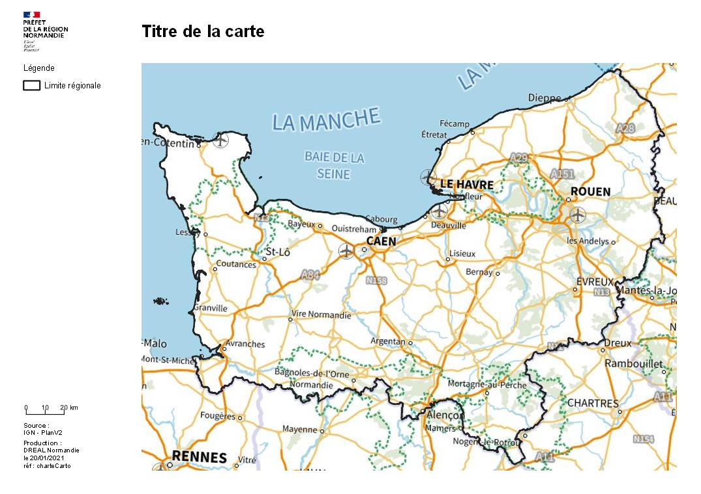

# Mise en page à la charte graphique gouvernementale

Ce répertoire contient l'ensemble des fichiers portant sur la mise en page d'une carte de la DREAL Normandie à la charte gouvernementale

Vous pourrez trouver dans le répertoire `documentation/` le mode d'emploi de cette charte et dans le dossier `fichiers` le fichier modèle de mise en page pour [QGIS](http://www.qgis.org) au format `.qgt`

