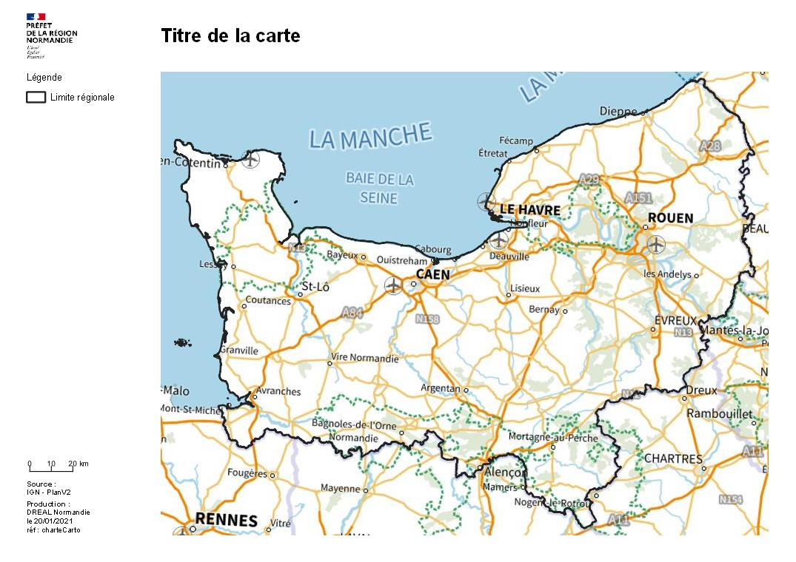
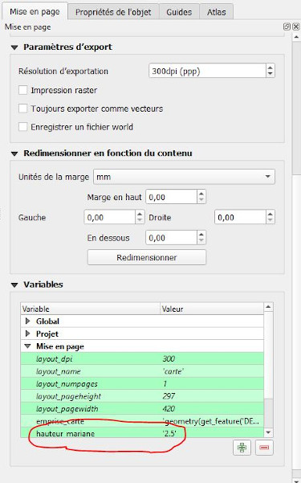
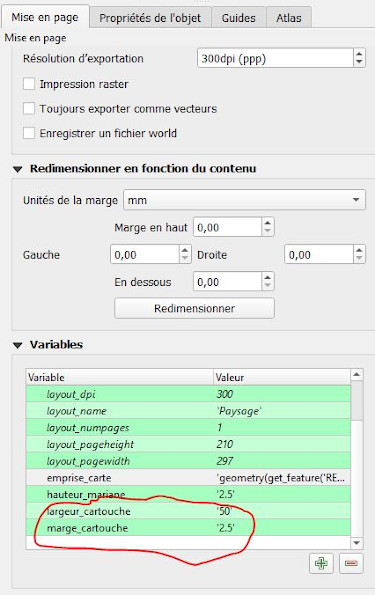

# Mise en page à la charte graphique DREAL



## Contexte

Cette charte n'est à appliquer que lorsque la carte à produire est un document à part entière.

**Elle n'a pas à être utilisée pour une carte qui est destinée à être intégrée dans un document possédant déjà sa propre charte graphique.**

Ce document explique comment configurer la mise en page dans QGIS afin d'obtenir le résultat escompté. 

Il ne traite pas du contenu de la carte (fond à utiliser, sémiologie graphique...) et se limite qu'au cas d'une production "simple". Il n'aborde pas le cas des atlas.

## les fichiers disponibles

Le principe général est de suivre au plus pret les règles définies dans la [charte gouvernementale](https://www.gouvernement.fr/charte/charte-graphique-les-fondamentaux/introduction). 
Cette charte ne fait donc plus de distinction thématique (choix d'une couleur par thème) et se veut plus sobre mettant en avant le contenu de la carte.

Un seul fichier de mise en page QGIS (.qpt) permet de réaliser l'ensemble des formats A3, A4, A5, paysage, portrait, etc. La mise en forme s'adapte en fonction des critères que le cartographe renseignera.


Le bloc-marque au format svg est stocké sur un serveur web internet.

Une fonction personnalisée QGIS qui renvoie la hauteur ou la largeur d'un élément de la mise en page a été développée pour les besoins de la mise en page :

```python
from qgis.core import *
from qgis.gui import *

@qgsfunction(args='auto', group='Custom')
def dimension_objet_mise_en_page(value1, value2, value3, feature, parent):
    """
    Donne la hauteur ou la largeur d'un objet d'une mise en page.
    <h2>Example usage:</h2>
    <ul>
      <li>dimension_objet_mise_en_page('mise_en_page','objet','hauteur') -> 13</li>
      <li>dimension_objet_mise_en_page('mise_en_page','objet','largeur') -> 12</li>
    </ul>
    """
    manager = QgsProject.instance().layoutManager()
    layout = manager.layoutByName(value1)
    mapItem = layout.itemById(value2)
    if value3 == "hauteur":
       return mapItem.rectWithFrame().height()
    elif value3 == "largeur":
        return mapItem.rectWithFrame().width()
    else:
        return "erreur"
```

Elle permet l'automatisation du placement d'élément les un par rapport au autre notamment lors de la modification du blocs `sources`.

Cette fonction doit être intégré à QGIS avant l'utilisation du modèle.

## Les éléments paramétrables

### Le format de la page

Le format de la page se paramètre via les "propriétés de la page" accessible par un clic droit sur la page.

Là, l'opérateur peut choisir la taille de sortie de la page (A4, A3, A5,...) et son orientation. La mise en page s'adaptera automatiquement aux choix qui sont faits.

### La hauteur de la Marianne

Les documents produits selon la charte gouvernementale suivent des règles de composition basées sur la hauteur de la Marianne du bloc-marque. Par défaut et pour l'utilisation au format A3, A4 et A5, cette hauteur est fixée à `2,5 mm`. Dans le cadre d'une production particulière cette hauteur peut être modifiée en changeant la valeur de la variable de mise en page `@hauteur_marianne`



La mise en page se mettra à jour automatiquement en fonction de la valeur de cette variable.

### Le choix de l'emprise

L'emprise de la carte, avec notament les paramètres `Échelle`, `Min X`, `Max X`, `Min Y` et `Max Y`, peut être définie automatiquement via la variable de mise en page `@emprise_carte`


Cette variable stocke une chaine de caractère dont l'évaluation donne la géometrie de l'objet définissant l'emprise. Ainsi, si l'objectif est de produire une carte sur le département du Calvados et que le projet contient la couche `DEPARTEMENT` possédant l'attribut `insee_dep`, l'opérateur pourra renseigner dans cette variable la valeur `geometry(get_feature('DEPARTEMENT','insee_dep','14')`. 

L'échelle et l'emprise seront alors modifiées automatiquement pour obtenir le résultat souhaité.

### Autres éléments paramétrables

Deux autres éléments sont paramétrables pour régler la composition de la carte. Il s'agit de la **largeur du cartouche** et de la **dimension des marges internes au cartouche**. Ces paramétrages s'effectuent respectivement dans les variables de mise en page `@largeur_cartouche` et `@marge_cartouche`



## Les éléments à modifier

### La légende

L'opérateur choisira les éléments à intégrer dans la légende.

### Le titre

Le titre de la carte doit être renseigné manuellement dans le cadre prévu à cet effet. Il doit être simple et explicite comme par exemple `Les plans de prévention des risques en Normandie au 1er janvier 2020`

### Les sources

La mention des sources est une obligation et doit s'effectuer selon les obligations fixées par le producteur de la donnée représentée.

exemple :

```
- IGN, AdminExpress COG 2020
- DREAL Normandie, ZNS 2020
```

### La référence

La référence prend le nom du fichier projet QGIS. Avant d'exporter le résultat de la mise en page, il convient donc d'enregistrer le projet QGIS.